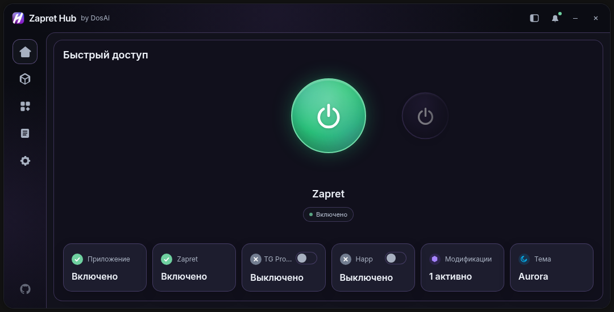
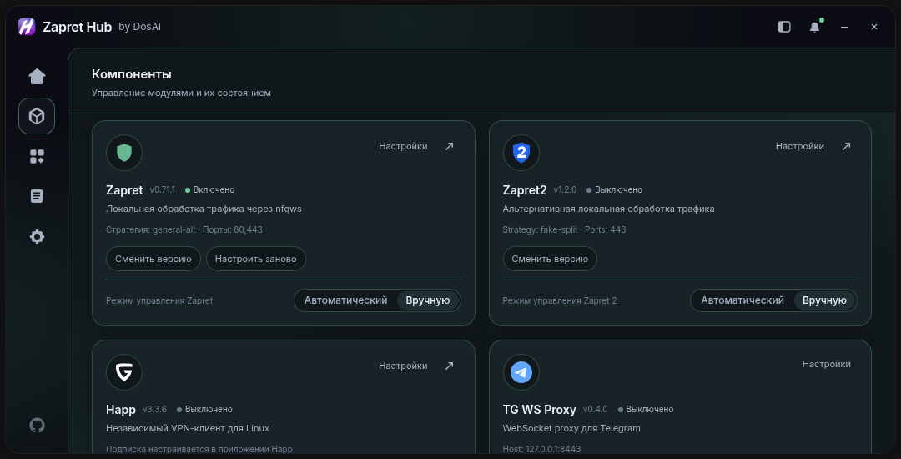
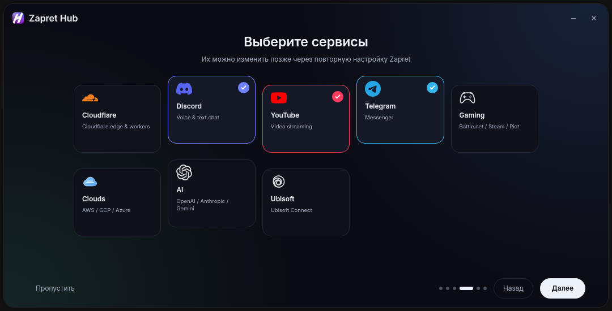

<div align="center">

# Zapret Hub Linux

Графическая панель для Zapret, Zapret2, Happ и TG WS Proxy на Linux.

**Автор Linux-форка: [DosAi](https://github.com/DosAi)**<br>
[Репозиторий](https://github.com/DosAi/Zapret-Hub-Linux) · [Telegram: @dosai_main](https://t.me/dosai_main)

</div>

> [!IMPORTANT]
> Это Linux-only форк. Полное функциональное тестирование выполняется на
> **Kali Linux**; установщик дополнительно проходит CI-проверку в настоящих
> контейнерах Debian, Fedora, Arch и openSUSE.
> **Windows не поддерживается:** мы не выпускаем `.exe`, Windows-инсталляторы
> или Windows-инструкции. Для управления компонентами требуется `systemd`.
> Alpine/OpenRC пока намеренно не поддерживается.

## Что это

Zapret Hub Linux — отдельный экспериментальный форк с Linux-бэкендами,
`systemd`, `nftables` и PolicyKit. Он даёт единое окно для выбора стратегии
обхода и управления дополнительными компонентами.

Портирование, отладка, подготовка установщика и тестов выполнены DosAi
при помощи **ChatGPT от OpenAI**.

[English README](README_EN.md)

## Что вошло в версию 3.2.0

- автоматическая установка Zapret, Zapret 2, Happ и TG WS Proxy из одного скрипта;
- нативные Linux-бэкенды Zapret и Zapret 2 с `systemd` и `nftables`;
- выбор Zapret/Zapret 2 без автозапуска при пролистывании;
- независимый Happ, который может работать параллельно с Zapret или Zapret 2;
- отдельные тумблеры Happ и TG WS Proxy на главной странице;
- локальный Telegram-прокси и кнопка подключения Telegram Desktop;
- одноразовая авторизация администратора при установке и ограниченные PolicyKit-правила;
- сохранение текущих VPN, сетевых служб и сторонних конфигураций при повторной установке;
- исправленные Linux-иконка, размер окна и одинаковые карточки статуса.
- очищенные Linux-only релизные архивы без legacy Windows-payload и VPN-конфигураций.
- совместимые с актуальным Kali зависимости PolicyKit (`polkitd` и `pkexec`
  вместо удалённого метапакета `policykit-1`).
- экспериментальный установщик для Debian/Ubuntu, Fedora, Arch и openSUSE;
- официальные форматы Happ `.deb`, `.rpm` и `.pkg.tar.zst` с проверкой SHA-256;
- реальный CI-smoke-test имён зависимостей в контейнерах поддерживаемых семейств;
- исправленные Linux-команды `ping`, `/dev/null` и определение установленной версии Happ.

## Интерфейс



<details>
<summary>Ещё скриншоты</summary>





</details>

Скриншоты созданы из тестового Web UI и не содержат пользовательских настроек,
подписок или учётных данных.

## Возможности

- Zapret2 через `nfqws2`, `nftables` и `zapret2.service`;
- автоматическая установка классического Zapret для Linux;
- [Happ](https://github.com/Happ-proxy/happ-desktop) через официальный Linux-клиент и deeplink-команды;
- локальный TG WS Proxy на `127.0.0.1:1443`;
- общая кнопка питания и отдельные переключатели компонентов;
- свободное листание стратегий без их автоматического запуска;
- ограниченное PolicyKit-правило для управления Zapret-сервисами;
- автозапуск и ярлык в меню приложений Kali.

Windows-runtime и payload legacy VPN из upstream-версии в этот форк не входят.
Happ добавлен как отдельный независимый компонент.

## Состав репозитория

Репозиторий очищен от Windows-сборок, `.exe`, WinDivert,
v2rayN, WinGet/Nuitka-инсталляторов и унаследованных скриншотов.
Встроенный Zapret2 содержит только Linux-бинарники `x86_64` и
`arm64`, а TG WS Proxy — только модули, нужные Zapret Hub.

## Установка на Linux с systemd

Основная проверенная система — Kali Linux. Debian/Ubuntu, Fedora, Arch и
openSUSE поддерживаются экспериментально: CI проверяет определение системы,
пакетного менеджера и наличие всех имён зависимостей, но не проверяет работу
обхода у конкретного провайдера.

Zapret Hub Linux не распространяется через APT/DNF/AUR и не выпускается
отдельными DEB/RPM-пакетами. Поддерживаемый способ установки — скачать исходники
с GitHub и запустить корневой `install.sh`.

Вставьте в терминал одну команду:

```bash
git clone --depth 1 https://github.com/DosAi/Zapret-Hub-Linux.git && cd Zapret-Hub-Linux && ./install.sh
```

Установщик сам определит `apt`, `dnf`, `pacman` или `zypper`, подготовит
зависимости, классический Zapret, Zapret2, Happ, TG WS Proxy, Python-окружение,
Web UI, PolicyKit-правило и ярлык. После установки приложение доступно в меню и
автоматически запустится. Позже его можно открыть из меню или командой:

```bash
~/.local/bin/zapret-hub
```

**Telegram Desktop не устанавливается автоматически.** Если нужно явно
установить его вместе с Zapret Hub:

```bash
./install.sh --with-telegram
```

Предварительный просмотр без изменений системы:

```bash
./install.sh --dry-run --no-launch
```

Установщик не запускает, не останавливает и не перезапускает сетевые службы,
а также не меняет их автозапуск. Уже установленный Happ пропускается без обновления и
перезапуска, поэтому текущий VPN остаётся нетронутым. Сторонние
установки Zapret и `/opt/zapret2` не перезаписываются.

Подробности: [README_LINUX.md](README_LINUX.md).

## TG WS Proxy

Прокси работает локально и не открывает порт во внешнюю сеть. Его можно
включать отдельно на главной странице либо запускать вместе с обходом.
Для подключения Telegram Desktop используйте кнопку **«Подключить Telegram»** в
карточке компонента.

Быстрая проверка порта:

```bash
ss -ltn | grep ':1443'
```

## Happ

Happ включается отдельным тумблером на главной странице или в разделе
«Компоненты». Он может работать одновременно с Zapret или Zapret 2; переключение и выключение
основного обхода Happ не затрагивает. Подключение и отключение выполняются через официальные
deeplink-команды. Импорт
подписки и выбор сервера выполняются в самом Happ по кнопке **«Открыть Happ»**.
Серверы или VPN-подписки в репозиторий не входят: пользователь добавляет свою конфигурацию в Happ.

## Ограничения

- полное функциональное тестирование проводилось только на Kali Linux;
- Debian/Ubuntu, Fedora, Arch и openSUSE пока имеют статус experimental;
- Alpine/OpenRC не поддерживается: официальный Happ и готовые PySide6-сборки
  требуют совместимого glibc/systemd-окружения;
- форк не является VPN и не отправляет трафик на серверы DosAi;
- результат обхода зависит от провайдера, региона и выбранной стратегии;
- управление Happ проверено только с официальным Linux-клиентом 3.3.6.

## Диагностика и тесты

```bash
.venv/bin/zapret-hub-linux diagnose
.venv/bin/zapret-hub-linux start --dry-run
.venv/bin/pytest -q
```

Журнал TG WS Proxy: `logs/tg_ws_proxy.log`.

## Исходные проекты и благодарности

Этот форк не претендует на авторство встроенных open-source компонентов.

- [Zapret Hub — upstream, от которого был создан Linux-форк](https://github.com/goshkow/Zapret-Hub)
- [zapret](https://github.com/bol-van/zapret) и [zapret2](https://github.com/bol-van/zapret2) — **bol-van**
- [zapret-discord-youtube-linux](https://github.com/Sergeydigl3/zapret-discord-youtube-linux) — **Sergeydigl3**
- [tg-ws-proxy](https://github.com/Flowseal/tg-ws-proxy) — **Flowseal** и участники
- [Happ Desktop](https://github.com/Happ-proxy/happ-desktop) — **Happ-proxy**
- [zapret-discord-youtube](https://github.com/Flowseal/zapret-discord-youtube) — **Flowseal** и участники

Ссылка на upstream сохранена только для атрибуции и соблюдения лицензии; этот
Linux-форк не является официальным релизом upstream-проекта.

## Связь

Ошибки, идеи и результаты тестирования: [@dosai_main](https://t.me/dosai_main).
Перед отправкой отчёта ознакомьтесь с [политикой безопасности](SECURITY.md) и
[рекомендациями для участников](CONTRIBUTING.md). Не прикладывайте реальные
подписки, токены, прокси-секреты или приватные логи к публичным issue.

## Лицензия

Изменения Linux-форка распространяются на условиях [MIT License](LICENSE).
Встроенные проекты сохраняют свои лицензии и авторские уведомления.
